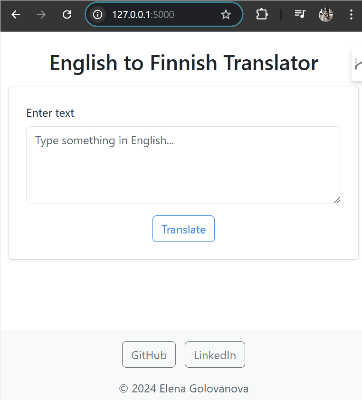

🔔 🦄🦄🦄 🔔
---

# English to Finnish Translator

## Overview

This is a simple *English to Finnish Translator* built using **Flask** on the backend and modern **JavaScript** on the frontend. The app allows users to input English text, translates it to Finnish using the **Helsinki-NLP Opus-MT model**, and displays the translated text on the same page without reloading. The solution leverages Flask's routing and middleware capabilities, the Hugging Face Transformers library for translation, and JavaScript's fetch API for dynamic updates.

## Features

- Translate text from English to Finnish using the Helsinki-NLP/opus-mt-en-fi model from Hugging Face.
- Interactive UI with real-time user input and results.
- Hosted on a free-tier server for demonstration purposes.

## Technologies Used

- **Backend**: Flask, Python, Hugging Face Inference API
- **Frontend**: HTML, JavaScript, Bootstrap

## How to Use

1. Enter English text in the text field on the page.
2. Click the "Translate" button to get the Finnish translation.

## Project Structure

The project uses a layered architecture for better modularity and scalability.
Here's a breakdown of the structure:

```
metropolia-ai-project/
├── app.py                 # Main Flask application entry point
├── controllers/           # Handles request-response logic
│   └── translation_controller.py
├── services/              # Business logic and integrations
│   └── translation_service.py
├── middlewares/           # Error handling and other middleware
│   └── error_handler.py
├── static/                # Static files (CSS, JS)
│   └── scripts/
│       └── index.js       # JavaScript for dynamic form submission
├── templates/             # HTML templates for the frontend
│   └── index.html
├── assets/                # solution 1 navigation demo
│   └── solution1-navigation-demo.gif
├── venv/                  # Virtual environment for Python dependencies
├── .gitignore             # Git ignored files and directories
├── README.md              # Project documentation (this file)
└── requirements.txt       # Python dependencies
```

## Translation Service Implementation

I have done two different implementations (Solution 1 and Solution 2) for handling English-to-Finnish translations.
<details>

<summary>Solution 1 (*current): Local Model Loading -- For Local Use</summary>
This solution uses the Helsinki-NLP/opus-mt-en-fi translation model from Hugging Face by loading it locally via the transformers library.

**Advantages:**
- No reliance on external APIs.
- Ideal for local development on machines with sufficient memory.

**Limitations:**
- Memory-intensive and cannot be deployed on free-tier platforms like Render.
- Requires downloading and initializing the entire model on the local machine.

</details>

<details>
<summary>Solution 2: Hugging Face Inference API -- For Local and Deployment</summary>
This solution utilizes the Hugging Face Inference API, offloading the translation model to Hugging Face’s servers.

**Advantages:**
- Lightweight and works well on platforms with limited memory, such as free-tier Render deployments.
- Can be deployed and accessed remotely.

**Limitations:**
- Depends on the availability and performance of the Hugging Face API.
- Requires a valid Hugging Face API token.

</details>

## How to Run Locally with Solution 1:

<details>

<summary>1. Clone the repository:</summary>

```
git clone https://github.com/ElenaCoder/metropolia-ai-project-local.git
cd metropolia-ai-project-local
```
</details>

<details>

<summary>2. Set up a virtual environment (optional):</summary>

```
python -m venv venv
source venv/Scripts/activate  # Windows
# or
source venv/bin/activate      # macOS/Linux
```
</details>

<details>

<summary>3. Install the required Python packages:</summary>

```
pip install -r requirements.txt
```
</details>

<details>

<summary>4. Run the application:</summary>

```
python app.py
```
</details>

<details>

<summary>5. Access the app:</summary>

Open `http://127.0.0.1:5000` in your browser.

</details>


## Project preview

Explore a sneak peek of the **English to Finnish Translator - Solution 1** project with this animated GIF showcasing key features and the user interface.



## Contact
For questions or feedback, feel free to reach out:
 - [GitHub: ElenaCoder](https://github.com/ElenaCoder)
 - [LinkedIn: Elena Golovanova](https://www.linkedin.com/in/elena-golovanova/)
